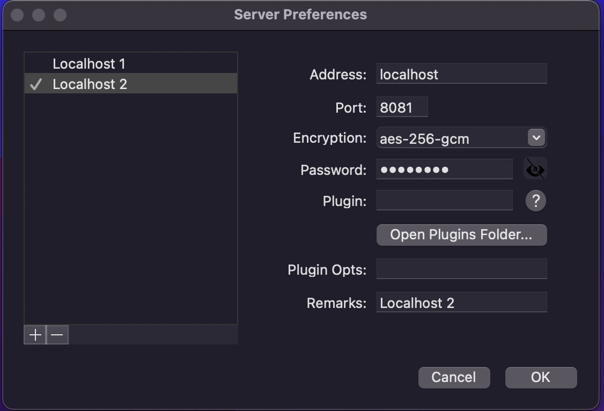

# Network Traffic Forward

> For the following examples simulated using `docker-compose.yml`, run `docker compose up` within their workspace directories to start the containers.

## Nginx Forward HTTP

> A simple website traffic redirection

[Workspace (./nginx)](./nginx)

[docker-compose.yml](./nginx/docker-compose.yml)

```yaml
version: "3.9"
services:
  server1:
    image: nginx
    ports:
      - 8080:80
    volumes: 
      - ./server1.conf:/etc/nginx/nginx.conf
    depends_on:
      - server2
  server2:
    image: nginx
```

[Nginx Configuration](./nginx/server1.conf)

```properties
...
stream {
    server {
        listen 8080;
        proxy_pass server2:80;
    }
}
...
```

Access `http://localhost:8080` after starting the containers, you should see the default nginx page.

`server2` service serves the actual website. When accessing `http://localhost:8080`, you are connected to `server1` service and the traffic is forwarded to `server2` port 80.


## iptables

[Workspace (./iptables)](./iptables)

[docker-compose.yml](./iptables/docker-compose.yml)


## Nginx Shadowsocks

> Shadowsocks traffic redirection using Nginx

[Workspace (./nginx-ss)](./nginx-ss)

[docker-compose.yml](./nginx-ss/docker-compose.yml)


```yaml
version: "3.9"
services:
  ss-server:
    image: shadowsocks/shadowsocks-libev
    ports:
      - 8080:8388
      - 8080:8388/udp
    environment:
      - PASSWORD=password
  nginx-server:
    image: nginx
    volumes:
      - ./nginx-server.conf:/etc/nginx/nginx.conf
    ports:
      - 8081:8388
      - 8081:8388/udp
    depends_on:
      - ss-server
```

[Nginx Configuration](./nginx-ss/nginx-server.conf)

```properties
...
stream {
    server {
        listen 8388;
        proxy_pass ss-server:8388;
    }
}
...
```

With this configuration, you can connect to either `localhost:8080` or `localhost:8081`. Enable **Global Mode** so that when you access a Chinese website, it won't work unless you are successfully connected to Shadowsocks (I was using baidu.com).

Configure the server like this




Localhost 1 (port 8080) is for direct connection to Shadowsocks Server

Localhost 2 (port 8081) is for indirect connection. The traffic is sent to an Nginx server (nginx-server) and forwarded to the Shadowsocks server (ss-server)

Note: 
- Shadowsocks listens on port 8388 by default, that's why it's used for port mapping. 
- `aes-256-gcm` is the default encryption method of Shadowsocks docker image.
- Password for Shadowsocks conection is `password` (specified in `docker-compose.yml`)